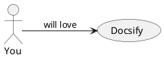

# Documentation

The subset of documentation tools of interest should be:
**free**, **work offline**, **easy to edit**, and **easy to deploy**.

This *excludes* tools like Microsoft Teams, Google Sites, GitBook.<br> 
This *includes* tools like VuePress, Docusaurus, Jekyll, Mkdocs and many more, but we chose **Docsify**.
 
## Docsify 
[Docsify](https://docsify.js.org/#/) uses the [markdown](https://en.wikipedia.org/wiki/Markdown) format, 
has [Vue](https://docsify.js.org/#/vue) compatability and enables some [extensions](https://docsify.js.org/#/helpers), and a long list of [plugins](https://docsify.js.org/#/awesome?id=plugins) like: [Tabs](https://jhildenbiddle.github.io/docsify-tabs/#/) and [PlantUML](https://github.com/imyelo/docsify-plantuml).


### The tabs plugin
<!-- tabs:start -->

#### ** JavaScript **
```javascript
{
  json: ['rigid', 'better for data interchange' ],
  yaml: ['slim and flexible', 'better for configuration' ],
  object: { key: 'value' },
  paragraph: 'Blank lines denote\nparagraph breaks\n',
  content: 'Convert line breaks\nto save space'
}
```
#### ** JSON **
```json
{
  "json": [
    "rigid",
    "better for data interchange"
  ],
  "yaml": [
    "slim and flexible",
    "better for configuration"
  ],
  "object": {
    "key": "value"
  },
  "paragraph": "Blank lines denote\nparagraph breaks\n",
  "content": "Convert line breaks\nto save space"
}
```
#### ** YAML **
```yaml
---
# <- yaml supports comments, json does not
# did you know you can embed json in yaml?
# try uncommenting the next line
# { foo: 'bar' }

json:
  - rigid
  - better for data interchange
yaml:
  - slim and flexible
  - better for configuration
object:
	key: value
paragraph: >
   Blank lines denote

   paragraph breaks
content: |-
   Convert line breaks
   to save space
```
<!-- tabs:end -->

### The UML plugin

Using www.plantuml.com/plantuml (see [guide.pdf](http://plantuml.com/guide))
```text
@startuml
left to right direction
You --> (Docsify) : will love
@enduml
```

